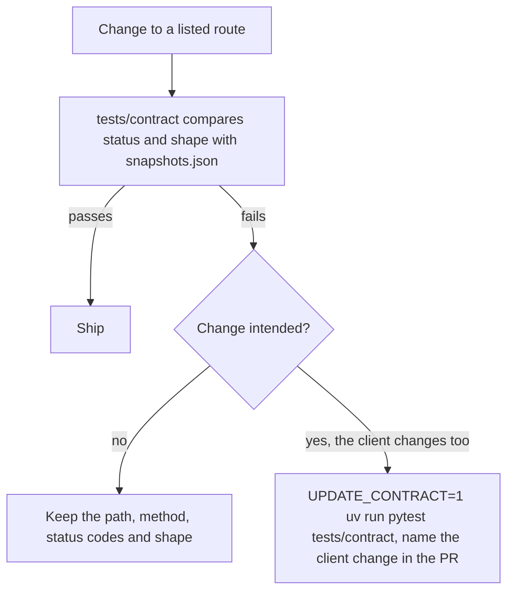

# API contract

Every endpoint a known client calls, so a change that would break a client is caught before it ships. `tests/contract/` checks the status code and response shape of each one against `tests/contract/snapshots.json`.

Inventory taken 2026-10-07 from asusoda/website at 26305fc and this repo's `web/` at 579a6a8.

## Rules

- A listed endpoint keeps its path, method, status codes and response shape.
- A change a client has to follow ships as a new route next to the old one. The old route goes only after every client has moved.
- If a contract test fails because the change is intended, regenerate the snapshots with `UPDATE_CONTRACT=1 uv run pytest tests/contract` and name the client change in the PR.

This diagram shows the check of a route change.

## SoDA's public website (asusoda/website, thesoda.io)

Calls `https://api.thesoda.io` (`VITE_API_URL`). Storefront and points calls send a Clerk session token as `Authorization: Bearer`.

| Method | Path | Caller | Auth | Contract case |
|---|---|---|---|---|
| GET | /api/calendar/soda/events | src/components/EventsPhotoCarousel.tsx:41 | none | calendar-events |
| GET | /api/points/soda/leaderboard | src/pages/LeaderBoard.tsx:114 | none | leaderboard |
| GET | /api/storefront/{org}/products | src/lib/api.ts:119 | none | products |
| GET | /api/storefront/{org}/products/{id} | src/lib/api.ts:122 | none | product |
| GET | /api/storefront/{org}/members/store | src/lib/api.ts:130 | Clerk | member-store-clerk |
| GET | /api/storefront/{org}/orders/{email} | src/lib/api.ts:134 | Clerk | orders-by-email |
| POST | /api/storefront/{org}/checkout | src/lib/api.ts:147 | Clerk | checkout |
| GET | /api/storefront/{org}/wallet/{email} | src/lib/api.ts:164 | Clerk | wallet |
| POST | /api/points/{org}/member_login | src/lib/api.ts:172 | none | member-login |

## Member fields

The `users` columns are `student_id` and `class_standing`; each membership has `profile_fields`, an object of fields the org defines (strings, numbers, booleans). The old keys stay on every route:

- **Deprecated keys:** `asu_id` (now `student_id`) and `academic_standing` (now `class_standing`). thesoda.io sends `asu_id` to `POST /api/points/{org}/member_login` and the dashboard sends and reads both, so they are accepted and returned until those clients move.
- Requests accept the old and the new keys. When both are sent, the new key wins.
- Every response that returned the old keys still returns them. Responses that are not pinned by a contract snapshot also return `student_id`, `class_standing` and, where the route is scoped to one org, `profile_fields`.
- `POST /api/points/{org}/member_login`, `GET /api/points/{org}/users` and `GET /api/public/{org}/leaderboard` and `/users` return only the old keys, so their snapshots are unchanged. The public routes still leave out emails and student IDs for anyone but the org's officers.

## Platform dashboard (dashboard/)

The dashboard replaces the older `web/` app and calls the same routes. Officer pages send the platform JWT from login. The member store pages (`/store/<org>`) send the session cookie.

| Area | Endpoints |
|---|---|
| Auth | GET /api/auth/login, GET /api/auth/callback (redirects to /auth/?code=…), POST /api/auth/exchange, GET and DELETE /api/auth/appTokens (new, no client yet), GET /api/auth/name, GET /api/auth/validToken, POST /api/auth/refresh, POST /api/auth/logout |
| Organizations | GET /api/organizations/, PUT /api/organizations/{id}/settings, GET and PUT /api/organizations/{id}/calendar |
| Points | GET and POST /api/points/{org}/users, PUT /api/points/{org}/users/{user}, GET /api/points/{org}/users/{user}/points, POST /api/points/{org}/assign_points, DELETE /api/points/{org}/delete_points, POST /api/points/{org}/uploadEventCSV, POST /api/points/{org}/member_login, GET /api/points/{org}/member_profile |
| Public | GET /api/public/{org}/leaderboard |
| Calendar | GET /api/calendar/{org}/events |
| Storefront | products (GET, POST, PUT, DELETE), orders (GET, POST, PUT), GET /api/storefront/{org}/store, members/store, members/orders (GET, POST) |
| Superadmin | GET /api/superadmin/check, GET /api/superadmin/dashboard, GET /api/superadmin/guild_roles/{guild}, POST /api/superadmin/add_org/{guild}, DELETE /api/superadmin/remove_org/{id}, PUT /api/superadmin/update_officer_role/{id} |

The contract cases cover the read paths of each area plus assign_points and checkout. The remaining write paths are listed here so later phases keep them.

## Other callers

- Deploys and container health checks call GET /health.
- The Discord bot runs in the API process and calls no HTTP endpoint.
- No other caller is known. The request log (below) is how unknown ones show up.

## Request log

Every /api request logs one line: method, route, status, org, credential kind (`none`, `session`, `access`, `refresh`, `app`, `untyped`, `external`), the Discord id from a platform token, the calling site's host, and the time taken. No token, cookie or body is logged. After a week of production logs this answers two questions phase 1 depends on: who still uses app tokens, and which officers act across orgs.

## Found while taking the inventory

These are recorded here, not fixed in phase 0.

- `GET /api/public/{org}/leaderboard` and `GET /api/public/{org}/users` returned every member's email and ASU ID with no authentication (contract case public-leaderboard). Phase 1 leaves those fields out for anyone but the org's officers once `ACCESS_ENFORCE=true`.
- The website's member store call (`GET .../members/store` with a Clerk token) gets 401 today, because `member_required` only accepts a Discord login session (contract case member-store-clerk). Either the website page is unused or it is broken in production.
- The old `web/` app calls routes that do not exist on the server, so those screens fail: `/api/getgamequestions`, `/api/startactivegame`, `/api/createchannels`, `/api/awardpoints` (the server has these under `/api/bot/`), `/games/*`, `/jeopardy/*`, `/bot/*`, `/points/leaderboard`, `/add-points`, `/remove-points`, `/auth/name`, `/auth/requestToken`. Files: components/GameBoard.js, SetupButton.js, AwardPanel.js, RequestManager.js, points/api.js, pages/GamePanel.js, ActiveGame.js, BotControlPanel.js, Jeopardy.js.
- App tokens carried no type claim, so they passed as officer access tokens. Phase 1 types them and scopes them to the issuing officer (docs/authentication.md, "Access checks").
