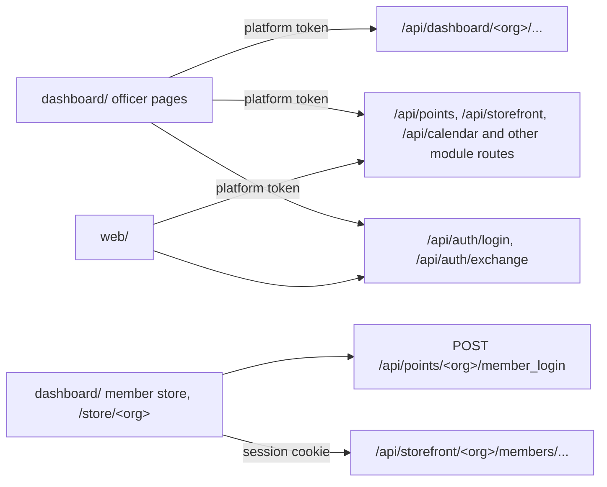

# Frontends

Platform has two officer frontends. `dashboard/` is the new one. Officers use it to see and control what each org runs. Members use its store pages, `/store/<org>`. `web/` is the old officer app, kept for SoDA at admin.thesoda.io.

This diagram shows the API routes that each frontend calls and the credential it sends.



## Officer dashboard

`dashboard/` is a Vite and React app with Tailwind and TanStack Query. It calls the API and has no server code.

The sidebar puts the pages in sections that follow the module categories on Explore: Storage (Knowledge, Points, Store), AI and agents (Agents), Webhooks (Events, Job alerts, Hackathons), Automations (Calendar, Uptime), Bots (LeetCode) and Compute (Godfather, Hosting). Tokens, Activity and Settings are at the bottom. Core modules have no section. A sidebar label is the short name of the page, without the category: Events, not Event webhooks.

`dashboard/src/pages/registry.tsx` has one entry for each page, with its section and its module.

The sidebar hides the page of an optional module when the module is off for the org. A section with no pages has no header. If you open the page of a module that is off, the page links to Explore. Old paths open the new pages: `ci` opens Activity, CI runs; `notifications` opens Activity; `modules` opens Explore; `integrations` opens the Integrations tab of Explore; `apps` opens Hosting; `compute` and `hosting?tab=pods` open Godfather; `mcp` opens Tokens; `alerts` opens Job alerts.

The sidebar collapses to a 56px rail of icons. To collapse or expand it, use the button at the left of the top bar, Ctrl+B (Cmd+B on a Mac) or `[`. The `[` key does nothing while you type in a field. The rail shows a tooltip with the page name on hover and on keyboard focus. The dashboard keeps the state in `localStorage` as `platform.sidebar`. On a phone, the sidebar is a menu that opens from the top bar.

The top bar above each page shows where the page is: Org / Section / Page. Each page starts with `PageHeader`: the title is the sidebar label of the page, one short line of description, a Docs link (`docs`) and the page actions on the right. A page does not explain itself in long text: it links to its page in `docs/`.

The pages use the same parts from `dashboard/src/components/ui/`: `CardHeader` with a title and a count, `TabBar` with a search field or filters on the right (`action`), icon buttons for row actions, and `Dialog` for every form that adds or edits. A list that can select rows uses `useSelection`, `Checkbox` and `SelectionBar` from `components/selection.tsx`: the row checkbox shows on hover, and the actions for the selected rows show in a bar at the bottom of the screen.

Lists that can be long (knowledge sources, points members and events, knowledge runs, store orders) show 100 rows, or 50 runs, and a button that shows more. A search field filters with `useDeferredValue`, so typing does not wait for the list. The audit log rows use `content-visibility: auto`.

The dashboard has one React Query client, made in `dashboard/src/lib/query-client.ts`. An answer is fresh for 30 seconds and stays in memory for 10 minutes after no page shows it, so a page opened again shows its data at once. A window focus does not refetch; pages with live data poll with `refetchInterval`. A list with a filter keeps the previous rows while the next ones load (`keepPreviousData`). The cache is in memory only, because answers hold member details; sign out clears it. A page entry in `registry.tsx` can have `prefetch`: the sidebar calls it on hover or keyboard focus, and the shell calls it when the page opens, so a gated page does not wait for its module check before it asks for its data. When requests fail together on an expired access token, they wait for one refresh.

| Page | Shows |
| --- | --- |
| Overview | A link to the open notifications in Activity, the main counts, CI, and the services, feeds and sessions of the modules that are on, recent changes and job runs |
| Explore | Second in the sidebar. Two tabs with one search field. Modules: each module that is not Core, in category sections, with the title, one line on what it does, a need that is not connected (a link to Integrations), and Add or Remove. Add is off until the needs are connected. Remove asks first, turns the module off and keeps its data. Modules that are always on show Included. Each module card lists its sub-modules: the sub-modules of Knowledge (Add or Sync) and the sub-module feeds of a webhook module (Add opens the new feed form on the page of the module). Integrations (`?tab=integrations`): the accounts and services the org connects, with state, keys, Test and the modules that use each one. See [integrations.md](./integrations.md) and [Categories, modules and sub-modules](./architecture.md#categories-modules-and-sub-modules) |
| Points | Members ranked by points, with the entries of each member. Award points to a member by email, username or Discord user ID. Upload an event check-in CSV. Events grouped by name, with delete for all entries of an event |
| Store | Products: add, edit (name, category, price in points, stock, image URL, description) and delete. Orders: change the status, add a message to the member, delete |
| Calendar | The Notion database and Google calendar settings, sync on or off, sync now, create the Google calendar, and the upcoming events |
| LeetCode | The daily post settings: channel, role to ping and time. The slash commands are in [leetcode](modules/leetcode.md) |
| Godfather | Pods that members connect to with the Godfather CLI, with their live status from their hosting provider: create, start, stop, restart, terminate, who can connect, sessions, files and pod settings. `godfather` module |
| Events | The org's outbound webhooks: add, edit, turn on or off, send test, delete. Each has a name, a destination (Discord), the events it sends and the result of its last message. See [webhooks.md](./webhooks.md) |
| Job alerts, Hackathons | The feeds of one webhook module: create, pause, run now, delete, and the history of each feed: its last 50 runs with counts and errors, and its last 50 items. `job-alerts?new=<submodule>/<feed>` and `hackathons?new=<submodule>/<feed>` open the new feed form with a feed of a sub-module. `job_webhook` and `hackathon_webhook` modules. See [feeds](modules/feeds.md) |
| Hosting | The org's bots, agents, sites and services on its hosting providers, grouped by kind, with the provider of each. RunPod is the only provider. Register app has a Provider select. Templates creates an app from a template in `apps/`, then opens the deploy form. Register a manifest or repo, see the pod and deployments, deploy a tag with a dry-run preview, roll back, delete. `runpod` module |
| Knowledge | Sources filtered by domain: upload documents one at a time or in a batch, add, edit, pause and run crawls, delete sources, change the passage size and search settings, and test a search. Sub-modules are on Explore. `knowledge` module |
| Agents | Conversation, memory, member and pending action counts, and the accounts members linked. It shows no conversation text. `agents` module |
| Uptime | Monitors with state, uptime over 24 hours and 7 days, last latency and the last 30 checks. Add, edit, pause, check now and delete. `uptime` module |
| Tokens | Machine tokens: create in a dialog and revoke. The MCP card shows how an agent connects: the server `/mcp` on port 8001 and the header `Authorization: Bearer plat_...`. A token's scopes set the tools the agent can call |
| Activity | Five tabs. Notifications: problems that need an officer (failed feed runs, failed deploys, knowledge sources that could not be fetched) and each webhook event of the org (errors, failed jobs, pods, deploys, store orders, new members), with no webhook needed. Errors: the org's errors from the error log, with the request or job, logger line, host, release and the stack trace, where Platform frames show apart from library frames. Changes: the org's audit log with pages. Knowledge runs: the last crawls and uploads with their errors. CI runs: the latest GitHub Actions runs for the repos the org lists. In Notifications and Errors, select rows to resolve, reopen or delete them together. Only events can be deleted; a problem goes away when its cause is fixed. The bell in the top bar shows the open count and the newest notifications. `/notifications` opens Activity |
| Settings | General, branding and org secrets |
| Superadmin | Orgs, officer roles, Discord servers without an org, the audit log of all orgs, and the errors of every org and of the server. Only the superadmin sees it |

The dashboard uses these officer routes in `modules/dashboard/`:

| Route | Does |
| --- | --- |
| `GET /api/dashboard/<org>/overview` | Every section in one response |
| `GET /api/dashboard/<org>/modules` | `categories`, and for each module that is not Core: `name`, `title`, `description`, `category`, `switchable`, `enabled`, `ready`, `needs` (each with `key`, `label`, `kind`, `optional` and `connected`) and `submodules`. Explore sets a switch with `PUT /api/organizations/<id>/modules` |
| `GET /api/dashboard/<org>/trends?days=30` | One series per chart, a value per UTC day (7 to 90 days). Modules that are off have no series |
| `GET /api/dashboard/<org>/ci` | The latest runs for each listed repo, kept in a cache for 120 seconds |
| `PUT /api/dashboard/<org>/ci/repos` | Sets the repo list: `{"repos": ["owner/name"]}`, 20 or fewer |
| `GET`, `PUT /api/dashboard/<org>/branding` | Gets or sets `logo_url` (https), `accent_color` (`#RRGGBB`) and `website_url` (https). An empty string or null removes a value |
| `/api/dashboard/<org>/webhooks/...` | List, add, change, delete and test outbound webhooks. See [webhooks.md](./webhooks.md) |
| `/api/dashboard/<org>/hosting/providers` | The hosting providers: `name`, `title`, `integration` and `configured` for the org. The Provider selects disable a provider that is not configured and link to Integrations |
| `/api/dashboard/<org>/apps/...` | List, register, delete, deploy and roll back apps, and read the pod. The same operations as `/api/apps` in [runpod-apps](modules/runpod-apps.md), for officers |
| `/api/dashboard/<org>/knowledge/...` | List and delete sources, upload documents, add and run crawls, read and set the search settings, start a reindex, read the run log, and search. The same operations as `/api/knowledge` in [knowledge](modules/knowledge.md), for officers. The sources list also says if the org may publish public sources |

The other pages use the routes of their modules: `/api/points`, `/api/storefront`, `/api/calendar`, `/api/compute`, `/api/feeds`, `/api/uptime`, `/api/organizations` and `/api/superadmin`.

For private repos, connect GitHub on the Integrations tab of Explore with a read-only token that can read Actions.

The Settings page has these sections: General (description, points per message, points cooldown), Branding and Secrets. The calendar and LeetCode settings are on the Calendar and LeetCode pages. The old links `settings#calendar`, `settings#leetcode` and `settings#modules` open the Calendar, LeetCode and Explore pages. The officer role shows there read-only. The Superadmin page shows only to the superadmin: it sets an org's officer role, adds an org for a Discord server the bot is in, removes an org, and shows the audit log of all orgs. It uses the `/api/superadmin/` routes. When the bot is not available, those routes return 503 and the page says so.

Each org sets its logo, accent color and website on the Settings page. The sidebar links to the website. The accent color sets the `--accent` CSS variable. Only primary buttons and the org initial use it. `--accent-fg` is black or white, for contrast. With no branding, the dashboard is gray and shows the first letter of the org name.

The dashboard uses the same type and colors as `site/`: Geist, Geist Mono and the gray tokens of the fumadocs-ui theme. The tokens are in `dashboard/src/index.css`. Light and dark follow the system; the switch at the bottom of the sidebar sets one. Transitions last 150 to 200 ms. If the system asks for reduced motion, the dashboard does not animate.

The sign-in page, the sign-in return and the org list use `AuthFrame`. It shows the Platform mark, the help links (Docs, GitHub, What is this?) and the org marks. The Docs and What is this? links, and the docs link of each page, go to https://platform.ais-asu.com. Set `VITE_SITE_URL` to use another deployment of `site/`.

A resolved notification stays hidden while its problem has the same message. When the message changes, it is open again. A resolved event stays resolved. The resolved ids are in the org config key `dashboard.resolved`. The org keeps its events for 30 days, at most the newest 200, in the `notifications` table.

The org marks (`OrgMarks` in `src/components/built-by.tsx`) show the orgs that build Platform as a row of round logos, one over the next. They show on the sign-in pages. The landing page of `site/` shows the same marks and, under the built-by line, the GitHub avatars of the repo's contributors (`site/components/contributors.tsx`, refreshed once a day). To add an org:

1. Put a square SVG logo with a transparent background in `dashboard/public/orgs/` and in `site/public/orgs/`.
2. Add one entry to `BUILT_BY` in `dashboard/src/lib/links.ts` and to `orgs` in `site/lib/orgs.ts`: the name, the short name, the website, the logo path and the fill of the disk. The fill is fixed, so the logo looks the same on light and dark pages.

To check that long lists stay fast, run `npm run perf` in `dashboard/`. It answers the API from `largeFixtures()` in `scripts/fixtures.mjs` (2,000 knowledge sources, 1,500 members, 600 orders, 1,000 audit log entries) and prints the time of each step and its long tasks.

The landing page shows dashboard screenshots from `site/public/screenshots/`. After a UI change, run `npm run screenshots` in `dashboard/`. The script builds the dashboard, serves it with `vite preview` and answers each API call from `scripts/fixtures.mjs`, a fictional org. It needs Playwright with Chromium. If the Chromium version does not match Playwright, set `PLAYWRIGHT_CHROMIUM` to the browser binary.

The hero of the landing page plays a demo video from `site/public/demo/`: `platform-demo.mp4`, `platform-demo.webm` and `poster.webp`. After a UI change, run `npm run demo-video` in `dashboard/`. The script builds the dashboard and uses the same fixtures. It clicks and types through each page with Playwright and takes a screenshot each time the page changes. Then it draws each frame (the window, the camera zoom, the pointer and the captions) and encodes the files with ffmpeg. It needs Playwright with Chromium and `ffmpeg` with libx264, libvpx-vp9 and libwebp. A run takes about 15 minutes. To change the story or the captions, edit `story()` in `scripts/demo-video.mjs`. `DEMO_FPS` sets the frame rate, and `DEMO_CRF` and `DEMO_VP9_CRF` set the quality of the MP4 and WebM files.

Officers sign in at `/api/auth/login?client=dashboard`. After Discord, the API sends them to `DASHBOARD_URL/auth/` with a one-time code.

```bash
cd dashboard
cp .env.example .env     # VITE_API_URL=http://localhost:8000
npm install
npm run dev              # http://localhost:5173
npm test
npm run build            # dist/
```

To deploy the dashboard:

1. Host `dashboard/` as a static site. On Vercel, set the root folder to `dashboard`, the build to `npm run build` and the output to `dist`. Send every path to `index.html`.
2. Set `VITE_API_URL` to the API URL.
3. Set `DASHBOARD_URL` on the API to the dashboard URL. The API adds it to CORS and uses it for the sign-in return.

### Code layout

`dashboard/src/pages/registry.tsx` lists every org page: its path, sidebar label, icon, sidebar section, optional module and page component. `src/app.tsx` makes the routes from this list, and `src/components/shell.tsx` makes the sidebar from it. A small page is one file in `src/pages/`. A large page is a folder, such as `src/pages/knowledge/`: `index.tsx` exports the page, and each other file holds one part. `shared.tsx` in a page folder holds the parts that two or more files of that page use.

These files hold the parts that two or more pages use. Use them on a new page. Do not style a one-off control.

| File | Holds |
| --- | --- |
| `src/components/ui/` (import from `components/ui`) | `PageHeader`, `Card`, `CardHeader`, `Row`, `Stat`, `StatGrid`, `Table`, `Th`, `Td`, `Tr`, `Button`, `DeleteButton`, `Input`, `SearchInput`, `Select`, `Textarea`, `Field`, `Switch`, `CheckOption`, `Badge`, `Dot`, `Mono`, `Code`, `EmptyState`, the loading skeletons, `ErrorNote`, `OkNote`, `Notice`, `Dialog`, `FormActions`, and `useShowMore` with `ShowMore` for long lists |
| `src/components/tabs.tsx` | `TabBar` and `useTabParam`: tabs that keep the open tab in `?tab=` |
| `src/components/tooltip.tsx` | `Tooltip`: a label on hover and keyboard focus, with optional keys. `Kbd` |
| `src/components/module-gate.tsx` | `ModuleGate` and `useModuleOn` |
| `src/components/activity-list.tsx` | The list of audit log entries |
| `src/lib/api.ts` | `api` and `send`, which call the API with the officer token |
| `src/lib/queries.ts` | Queries that two or more pages use, such as `useOverview` and `useModules` |
| `src/lib/format.ts` | Times, numbers, bytes and status tones |
| `src/lib/org.ts` | `useCurrentOrg`: the org in the URL |
| `src/lib/types/` | The shapes of the API responses, one file for each domain. `index.ts` exports all of them |

Put a part in `src/components/` or `src/lib/` only when two or more pages use it.

### Add a dashboard page

1. Write the page in `dashboard/src/pages/`. For a large page, make a folder with an `index.tsx` that exports the page.
2. Add one entry to `PAGES` in `src/pages/registry.tsx`. The order of `PAGES` is the order in the sidebar.
3. Add the types of the API responses to the domain file in `src/lib/types/`. If you add a file, export it from `src/lib/types/index.ts`.
4. Add a response for each API path the page reads to `dashboard/scripts/fixtures.mjs`.
5. Add a row for the page to the page table in this file.
6. Run `npm test` and `npm run build`.

These fields of a registry entry control who sees the page:

- `module`: the sidebar hides the page when the API says that this module is off for the org.
- `gate`: with `module`, the page shows a note with a link to Modules while the module is off. Without `gate`, the page opens and its API calls return 404.
- `superadmin`: only the superadmin sees the page in the sidebar. The page must also check `useSuperadmin()`.

An old path that opens another page goes in `REDIRECTS` in the same file.

## Member store

The member store is two open pages of `dashboard/`, outside the officer pages:

- `/store/<org>` shows the products in stock. A signed-in member also sees a cart, their points and their orders, and can place an order.
- `/store/<org>/login` signs a member in with `POST /api/points/<org>/member_login`.

These pages use the API session cookie, not the officer token. The order routes (`/api/storefront/<org>/members/...`) need a Discord session on the API. The browser sends the cookie only when the dashboard and the API are on the same site.

## Old officer app

`web/` is the old officer app (Create React App). SoDA serves it at admin.thesoda.io from the `web` compose service on port 5000. The dashboard runs beside it on port 5001. `web/` signs in with `POST /api/auth/exchange`. Its build reads `REACT_APP_API_URL`.

The dashboard has the pages of `web/`: member details are on Points (Add member, and Edit details in a member's history), and the store, calendar, Godfather and superadmin pages have dashboard pages. The Jeopardy and bot pages of `web/` call paths that the API does not have, so they are not in the dashboard.
