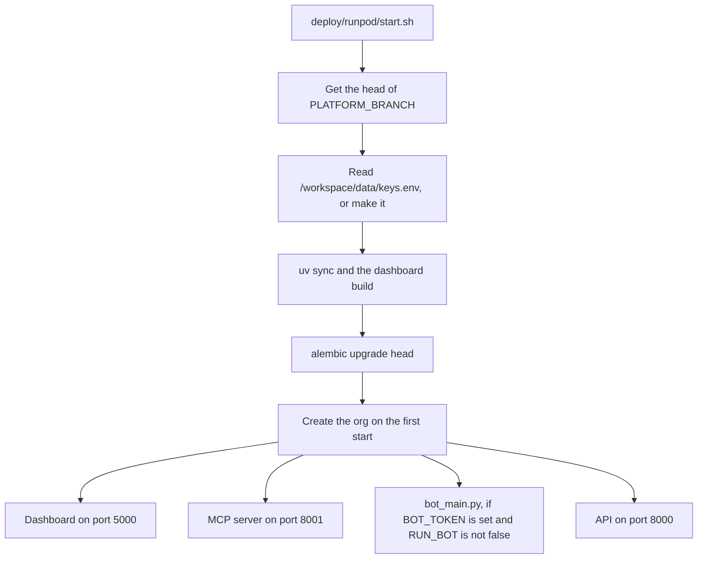

# Getting started

This page tells you how to run Platform on your machine, and on one RunPod pod without Docker.

## Tools

| Tool | Use |
| --- | --- |
| uv | Python 3.12, dependencies and the virtual environment |
| Podman and podman-compose, or Docker | The containers. The Makefile finds the one you have |
| make | Every command |
| Node 20 | Only to run `dashboard/` or `site/` outside a container |

## Run it on your machine

1. Clone the repo and install the Python dependencies:

   ```bash
   uv sync
   uv run pre-commit install
   ```

2. Copy `.env.template` to `.env`. Set the values in the table below.
3. Start the containers with `make dev`. The API is at http://localhost:8000, the dashboard at http://localhost:5001 and the old `web/` app at http://localhost:5000.
4. Create an org:

   ```bash
   flask --app main org create --name "Robotics Club" --prefix robotics --guild-id <server id> --officer-role-id <role id>
   ```

   The optional modules of a new org start off. Add them on the dashboard Explore page, or with `--on points,storefront`.

`make dev` adds `docker-compose.dev.yml`. It runs `python3 main.py` with the Flask reloader and mounts the source, so a Python change does not need a rebuild. The bot runs in the `bot` container.

To run the API with no container, run `uv run alembic upgrade head`, then `uv run python main.py`. In this mode the API also starts the bot in a thread. Set `RUN_BOT_IN_API=false` to stop that.

## Settings

`core/config.py` reads `.env`. `.env.template` lists every setting with a comment. A module page lists the settings of its module.

| Variable | Use |
| --- | --- |
| `BOT_TOKEN` | The Discord bot token. The API also uses it to read servers, roles and members. If it is not set, sign-in returns 503 |
| `CLIENT_ID`, `CLIENT_SECRET` | The Discord OAuth app for officer sign-in. It must be the app of `BOT_TOKEN` |
| `REDIRECT_URI` | `<API URL>/api/auth/callback`. It must be a redirect of the Discord app |
| `CLIENT_URL` | Sign-in from a client other than the dashboard sends the browser back to it |
| `SYS_ADMIN` | The Discord user id of the superadmin. For more than one superadmin, a comma-separated list of ids |
| `SECRET_KEY` or `FLASK_SECRET_KEY` | Signs session cookies. If neither is set, a random key is used and sessions end at each restart |
| `SECRETS_KEY` | A Fernet key that encrypts org secrets. If it is not set, orgs cannot save secrets |
| `DATABASE_URL` | Default `sqlite:///./data/user.db`. Use `postgresql://...` for Postgres |
| `ACCESS_ENFORCE` | `false` logs refused requests and lets them through. `true` refuses them. See [Authentication](./authentication.md) |

### Discord apps

Platform uses one Discord app: `BOT_TOKEN`, `CLIENT_ID` and `CLIENT_SECRET` all come from it. An agent bot that runs as a RunPod app (see [RunPod apps](./modules/runpod-apps.md)) gets its own token from an org secret, such as `app_<app>_discord_token`, not from these settings.

Platform can share the app of an agent bot. Then set `RUN_BOT=false`, so that only one process connects to Discord with the token.

`flask --app main config check` shows the bot name and app of `BOT_TOKEN`. It fails if `CLIENT_ID` is from a different app. `deploy/runpod/start.sh` runs it at each start, so the pod log shows the app.

## Commands

```bash
make dev       # start with logs and the reloader
make up        # start in the background
make down      # stop
make logs      # last 50 log lines
make status    # container status
make health    # container health
make shell     # shell in the API container
make check     # fix lint and format, then type check, tests, migrations
make ci        # the same checks with no changes to files; CI runs this
```

To run one test file: `uv run pytest tests/contract/test_godfather.py -v`. The tests use an in-process app and a temporary database. They need no running server.

## Run it on one RunPod pod

`deploy/runpod/start.sh` runs Platform on one CPU pod with no Docker. It starts the API on port 8000, the dashboard on 5000 and the MCP server on 8001. If `BOT_TOKEN` is set, it also starts the bot. Set `RUN_BOT=false` to use the token of a bot that runs elsewhere, such as an agent bot: the API then uses the token only for Discord's REST API, and the bot commands, LeetCode posts and games do not run. Do not run two bot processes with one token. Jobs run in threads of the API, on SQLite.

At each start the script gets the head of `PLATFORM_BRANCH`. A pod restart thus deploys the branch.

This diagram shows what the script does at each start.



Caution: keep `/workspace/data/keys.env`. It holds `SECRET_KEY` and `SECRETS_KEY`. If you lose it, the stored org secrets cannot be read.

1. Create a network volume and mount it at `/workspace`.
2. Create a pod from the image `nikolaik/python-nodejs:python3.12-nodejs20` with the ports `8000/http`, `5000/http` and `8001/http`.
3. Set the start command:

   ```
   bash -c "curl -fsSL https://raw.githubusercontent.com/theaisocietyasu/bedrock/$PLATFORM_BRANCH/deploy/runpod/start.sh | bash"
   ```

4. Set the pod environment from the table below.
5. Add `<API_URL>/api/auth/callback` as a redirect in the Discord app. For Godfather CLI sign-in, also add `<API_URL>/api/compute/cli/callback`.

| Variable | Value |
| --- | --- |
| `PLATFORM_BRANCH` | The branch to run |
| `ORG_PREFIX`, `ORG_NAME`, `ORG_GUILD_ID`, `ORG_OFFICER_ROLE_ID`, `ORG_MODULES_OFF` | The org that the script creates on the first start |
| `CLIENT_ID`, `CLIENT_SECRET`, `BOT_TOKEN`, `SYS_ADMIN` | As in the settings above |
| `RUN_BOT` | `false` to not start the bot process. The API still uses `BOT_TOKEN` |
| `API_URL`, `WEB_URL` | Only for a custom domain. The defaults are the pod proxy URLs, `https://<pod id>-8000.proxy.runpod.net` and `-5000` |

Agents connect to the MCP server at `https://<pod id>-8001.proxy.runpod.net/mcp` with a machine token.
