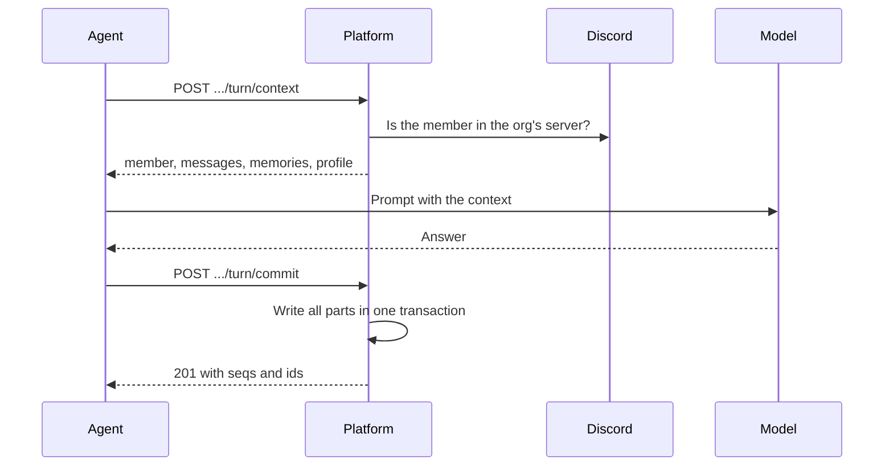

# Agents

Storage for agents that talk to members: conversations, memories, a profile graph, and pending actions that wait for the member to confirm. An agent on Platform keeps no database of its own.

## Access

- An agent uses a machine token of kind `agent` with `agents:read`, `agents:write` or both. The org is the org of the token. The agent names the member by Discord id in the path.
- A member signed in with Discord sees and deletes their own data at `/api/agents/<org>/me`.
- Officers and the superadmin have no route to agent data. Roles come from Discord, never from what an agent says.
- Orgs never share rows. The same Discord id in two orgs is two members.

## Routes

All routes are under `/api/agents/members/<discord_id>`.

| Route | Scope | Does |
| --- | --- | --- |
| `PUT /conversations/<uuid>` | write | Creates the conversation, or confirms the owner. Body: `channel_id`, `visibility` (`public`, `private`). 409 if a different member, channel or visibility has the id |
| `GET /conversations/<uuid>?visibility=` | read | `{"owned": bool}` |
| `GET /conversations/<uuid>/messages?limit=` | read | The newest summary, then up to `limit` messages after it, oldest first |
| `POST /conversations/<uuid>/messages` | write | Adds `messages: [{role, content}]` in one transaction. Returns their `seqs` |
| `POST /conversations/<uuid>/summary` | write | `content`, and `covers`, the last seq it replaces |
| `GET /channels/<channel>/latest?visibility=` | read | The open conversation with the latest update |
| `POST /channels/<channel>/end` | write | Ends the open conversations in the channel |
| `GET /memories?kinds=&limit=` | read | Memories that are not expired, highest confidence first |
| `POST /memories` | write | `kind` (`episodic`, `semantic`, `profile`, `task`), `content`, `sensitivity`, `confidence`, `source_seq`, `expires_in_days` |
| `DELETE /memories/<id>` | write | Deletes one memory |
| `GET /profile` | read | Nodes and relations |
| `POST /profile/facts` | write | `facts: [{subject: {kind, label}, relation, object: {kind, label}, confidence}]`. A row that exists keeps the higher confidence |
| `GET /profile/matching?subject=&relation=` | read | Relations from a subject. Case does not matter |
| `GET /profile/similar?text=&limit=` | read | The nodes nearest to the text by embedding, with `distance`. 503 if the org has no embeddings service |
| `DELETE /profile/relations` | write | Body: `subject`, `relation`, `object` |
| `DELETE /profile/nodes?label=` | write | Deletes the nodes with that label and their edges |
| `DELETE /data` | write | Deletes the member's profile graph and memories |
| `PUT /pending/<uuid>` | write | Holds an action: `action`, `payload_hash`, `ttl_seconds` (default 600) |
| `POST /pending/<uuid>/claim` | write | `approved: bool`. Returns the action one time. 404 if it is unknown, expired, answered or for a different member |

## Turns

An agent makes two calls for each turn, under `/api/agents/members/<discord_id>/turn`. Both ask Discord if the member is in the org's server. They return 403 if not, and 503 if Discord is not set up or does not answer.

| Route | Scope | Does |
| --- | --- | --- |
| `POST /context` | read | Body: `conversation_id`, `visibility`, and optional `message_limit` (50), `memory_kinds`, `memory_limit` (20), `profile_limit` (100), `profile_query`. A limit of 0 leaves that part out. Returns `member` (display name, role ids, officer, from Discord), `conversation` (`owned`), `messages`, `memories` and `profile`. With `profile_query` and an embedder, `profile.similar` has the nearest nodes |
| `POST /commit` | write | Body: `conversation_id`, `channel_id`, `visibility`, and one or more of `messages`, `summary`, `memories`, `facts` and `pending`, in the shapes above. One transaction: if a part is invalid, nothing is written. Returns 201 with `seqs`, `summary_seq`, `memory_ids`, `facts` and `pending` |

Agents that write during the turn can use the routes in the first table.

## Privacy

- Platform encrypts sensitive memories with `SECRETS_KEY`. Without it, the API refuses them (503) and leaves the stored ones out of reads.
- The `agents.prune` job deletes conversations with no update in `AGENT_RETENTION_DAYS` (default 180), expired memories, and pending actions one day after they expire.
- The audit log does not record the writes of a turn. It records deletes and confirmations.

## Limits

- Profile nodes match by exact kind and label. With an embeddings service, each node also gets a vector of "kind: label", so recall can start from what the member said. Platform does not merge similar nodes.
- The member routes need a Discord session with `discord_id`. The member store sign-in does not set it.
