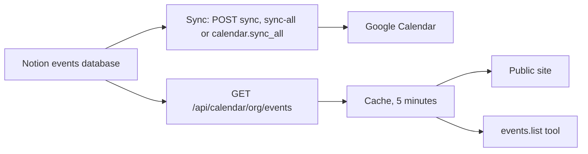

# Calendar

Syncs an org's Notion events database to a Google Calendar, and serves the org's upcoming events. Each org can use its own Notion token and Google service account.

## Setup

1. Set the org's calendar settings: `PUT /api/organizations/<org_id>/calendar` with `notion_database_id`, `calendar_sync_enabled` and, optional, `google_calendar_id`.
2. Connect Notion and Google on the Integrations tab of the dashboard Explore page (see [Integrations](../integrations.md)). If an org has no keys, Platform uses the deployment's `NOTION_API_KEY` and `google-secret.json`.

3. Share the Notion database with the Notion integration.
4. Start a sync: `POST /api/calendar/<org_prefix>/sync`.

If the org has no `google_calendar_id`, the first sync makes a calendar named "<org name> Events" in `TIMEZONE`.

If the saved Google key is not a JSON object, the sync fails. It does not use the deployment's account.

A calendar belongs to the service account that made it. If an org changes to a different account, share the calendar with the `client_email` of the new account ("Make changes to events"). Or clear `google_calendar_id`, and the next sync makes a new calendar.

## Notion properties

The Notion database must have these properties: `Name` (title), `Date` (date), `Location` (select), `Description` (rich text) and `gcal_id` (rich text). If a property has a different name, the sync skips the event and logs a warning.

## Sync

The sync gets all pages of the Notion database and all events of the Google Calendar. It finds the Google event of each page through the `notionPageId` in the event's extended properties. Then it:

1. Creates an event for each new page, and updates the events whose content changed.
2. Deletes Google events that point to the same page as a different event.
3. Deletes Google events whose Notion page is gone.
4. Sets `last_sync_at` on the org.

A sync occurs only when a caller starts it, with `POST /api/calendar/<org_prefix>/sync` or `POST /api/calendar/sync-all`. To sync on a schedule, set `CALENDAR_SYNC_CRON` (for example `0 */2 * * *`). The `calendar.sync_all` job then syncs each org with `calendar_sync_enabled`.

## Events

`GET /api/calendar/<org_prefix>/events` is open. It returns the org's events from Notion and keeps them in a cache for 5 minutes. The `events.list` tool returns the same events to agents with `calendar:read`. `calendar.settings` (scope `calendar:read`) and `calendar.update_settings`, `calendar.sync` and `calendar.setup` (scope `calendar:manage`) do what the Calendar page does.
