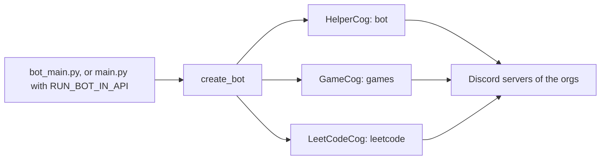

# Discord bot

One Discord bot serves every org on the deployment. Each org is a Discord server, and the bot joins each server. The bot runs the LeetCode commands, finds members and roles for access checks, and runs Jeopardy games.

## Run it

`bot_main.py` runs the bot as its own process. `make up` and `make deploy` start it as the `bot` service. To run it inside the API process, set `RUN_BOT_IN_API=true`.

Set these in `.env`:

| Setting | Use |
| --- | --- |
| `BOT_TOKEN` | The token of the Discord app |
| `CLIENT_ID`, `CLIENT_SECRET` | The same app's OAuth client, for dashboard sign-in |
| `RUN_BOT` | On a RunPod pod, `false` makes `deploy/runpod/start.sh` skip the bot. Use it when another program uses the same token |

`flask --app main config check` names the Discord app that owns `BOT_TOKEN`. It fails if `CLIENT_ID` belongs to a different app.

In the Discord Developer Portal, turn on the **Server Members** intent for the app. Without it, member lookups return nothing.

## Add it to a server

1. Open the app's OAuth2 URL generator in the Developer Portal.
2. Select the scopes `bot` and `applications.commands`.
3. Give it the permissions to read and send messages, embed links, manage roles and manage channels.
4. Open the URL and pick the org's server.

## What it does

| Part | Module | Does |
| --- | --- | --- |
| LeetCode commands | [LeetCode](./leetcode.md) | `/daily`, `/random`, `/link`, `/unlink`, `/leaderboard`, `/stats` |
| Helper | `bot` | Makes and removes channels and roles for other parts; `/clear` removes game channels |
| Jeopardy | `games` | Team roles and channels, questions and the scoreboard |

The [feeds](./feeds.md) of the webhook modules post through Discord webhooks, not through the bot. The `games` switch turns Jeopardy on and off.

## Jeopardy limits

- One game runs at a time for the whole deployment, in the first server of the bot.
- The game routes at `/api/bot` need the bot inside the API process. Under gunicorn they fail. Turn them off with `DISABLED_ROUTES=/api/bot/` if you do not use them.
