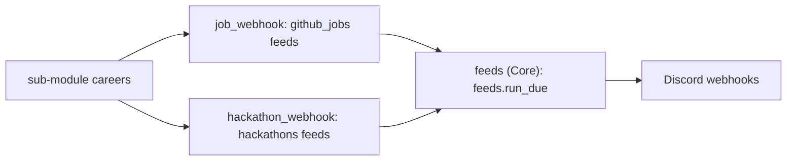

# Feeds and the webhook modules

Two modules post listings to Discord channels:

- **Job alerts webhook** (`job_webhook`) posts new internship and new grad roles from GitHub job lists.
- **Hackathon webhook** (`hackathon_webhook`) posts upcoming hackathons.

Both are in the Webhooks category and start off. The Core module `feeds` runs them. Each feed reads one source on a schedule and posts the new items to one Discord webhook. Org events such as errors use [event webhooks](../webhooks.md), not feeds.



## Feeds

Each kind of feed belongs to one module. If the module is off for the org, its feeds do not show and do not run.

| Kind | Module | Source | Item key |
| --- | --- | --- | --- |
| `github_jobs` | `job_webhook` | The job table in a GitHub repo's README (Company, Role, Location, Application/Link, Date Posted), as in the internship and new grad lists | A hash of company, role, first location, and link with no tracking parameters |
| `hackathons` | `hackathon_webhook` | Hack Club, Euro-Hackathons and Hackalist | The event name, in lowercase |

The `careers` [sub-module](./submodules.md) gives ready feeds of both kinds. On Explore, a webhook module that is on lists the sub-module feeds of its kind. **Add** on a feed opens the page of the module with the new feed form filled.

The first run of a feed records all current items and posts none. Thus a new feed does not post hundreds of old listings. Later runs post up to 25 new items, with half a second between posts. If a post fails, the item stays new and goes out on the next run.

## Dashboard

The Job alerts webhook page (`job-alerts`) shows the `github_jobs` feeds. The Hackathon webhook page (`hackathons`) shows the `hackathons` feeds. The old path `alerts` opens the Job alerts webhook page. On each page:

- **New feed** > **Start from** fills the form from a sub-module feed of that kind.
- `?new=<submodule>/<feed>` opens the new feed form with that feed.
- Each feed has pause, run now, delete, and its history.

## Routes

All routes are under `/api/feeds/<org>`, for officers of the org. A route for a feed whose module is off returns 404.

| Route | Does |
| --- | --- |
| `GET /feeds` | Each feed with its schedule, last run, last error and number of posts |
| `GET /feeds/<key>` | One feed |
| `PUT /feeds/<key>` | Creates (201) or updates (200) a feed. Body below |
| `DELETE /feeds/<key>` | Deletes the feed, its posted items and its webhook secret |
| `GET /feeds/<key>/history` | The last 50 runs (time, duration, items found, new and posted, error) and the last 50 items the feed posted or recorded |
| `POST /feeds/<key>/run` | Starts a run now and returns 202. With `{"post_existing": true}`, a first run posts the current items |
| `GET /presets` | The feeds that [sub-modules](./submodules.md) offer for the webhook modules that are on, with `module`, the `kind` and `config` to send to `PUT /feeds/<key>`, and `added` when the org has a feed with that key |

```json
{
  "kind": "github_jobs",
  "webhook_url": "https://discord.com/api/webhooks/<id>/<token>",
  "every_hours": 3,
  "enabled": true,
  "config": {"repo": "vanshb03/Summer2026-Internships", "label": "Internship"}
}
```

- The key has lowercase letters, digits and dashes, 40 characters or fewer.
- A new feed needs `webhook_url`. Platform keeps it as the org secret `alert_webhook_<key>` and never returns it. A route shows only if it is set.
- You cannot change `kind` after you create the feed.
- `every_hours` is 1 to 168, default 3.

`github_jobs` config:

| Field | Default | Does |
| --- | --- | --- |
| `repo` | required | `owner/name` on GitHub |
| `branch` | `main` | The branch to read |
| `path` | `README.md` | The Markdown file with the table |
| `label` | `Job` | The word in the post title, such as Internship |
| `skip_closed` | `true` | Leaves out roles marked closed |
| `max_age_days` | `2` | Leaves out rows with an older Date Posted. 0 turns off this check |

`hackathons` config:

| Field | Default | Does |
| --- | --- | --- |
| `sources` | all three | One or more of `hackclub`, `euro_hackathons`, `hackalist` |
| `min_days_ahead` | `0` | Leaves out events that start sooner |
| `max_days_ahead` | `90` | Leaves out events that start later |

A hackathon feed fails only if all its sources fail. MLH and Devpost refuse automated requests, so they are not sources.

## Tools

`feeds.list`, `feeds.presets`, `feeds.history`, `feeds.save`, `feeds.run` and `feeds.delete` (confirm) need the scope `feeds:manage`. They see only the feeds of the webhook modules that are on.

## Schedule

The `feeds.run_due` job runs every 15 minutes. It runs each enabled feed whose `every_hours` has passed since its last run, if the module of the feed is on for the org. A failed run keeps its reason in `last_error`. Each run, scheduled or started with Run now, adds a row to `alert_runs`; Platform keeps the last 50 for each feed. The next run occurs at the next due time.

## Move from a webhook script

1. If the module is off for the org, turn it on: `flask --app main org modules <prefix> --on job_webhook` (or `hackathon_webhook`).
2. Make a Discord webhook for each channel, or use the webhooks you have.
3. `PUT` one feed for each source. The first run records the current listings, so nothing is posted two times.
4. Stop the schedule of the old script.
