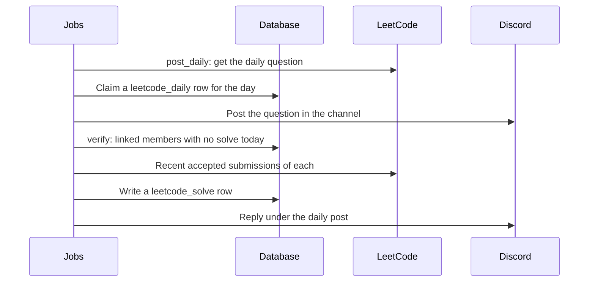

# LeetCode

Posts the LeetCode daily question in a Discord channel of the org. Members link their LeetCode handle, and Platform checks who solved the question. The `leetcode` switch turns the org's post on and off.

## Set it up

1. Turn on the `leetcode` module in Settings > Modules.
2. On the LeetCode page (Automations > Bots > LeetCode), set:
   - **Channel**: the Discord channel for the post.
   - **Role ping**: a role to mention in the post. Optional.
   - **Daily time**: the time of the post.
3. Make sure the Discord bot is in the server and can post in the channel.

## Discord commands

| Command | Does |
| --- | --- |
| `/daily` | Shows today's question |
| `/random` | Shows a random question. You can pick a difficulty |
| `/link <username>` | Links your LeetCode handle, for solve checks |
| `/unlink` | Removes the link |
| `/leaderboard` | Top daily solvers in this server (1 to 25 rows) |
| `/stats` | Linked members, active solvers and questions solved in this server |

## Jobs

| Job | Schedule | Does |
| --- | --- | --- |
| `leetcode.post_daily` | Every 5 minutes | Posts the question at the org's daily time, once a day |
| `leetcode.verify` | Every 10 minutes | Checks the recent solves of linked members and records today's solves |

## Routes

`GET` and `PUT /api/organizations/<org_id>/leetcode` read and set `channel_id`, `role_ping` and `daily_time`. Officers of the org only.

## Deployment-wide post

`LEETCODE_CHANNEL_ID`, `LEETCODE_ROLE_PING` and `LEETCODE_DAILY_TIME` in `.env` set one more post for the whole deployment. If you set an org's channel, remove `LEETCODE_CHANNEL_ID`. If you do not, the channel gets two posts.

## Tables

`leetcode_link` (member handles), `leetcode_solve` (one row for each member and day), `leetcode_daily` (one row for each posted day and channel).
