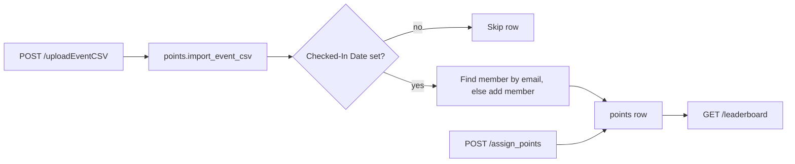

# Points

Keeps the points that an org's members earn at events. Officers add members, give points by hand or from an attendance CSV, and read the leaderboard. The `points` switch turns the module on and off.

## In the dashboard

The Points page (Storage > Points) has two tabs:

- **Members**: the leaderboard with each member's total. Search by name or email. Add a member, or give points to one member.
- **Events**: the points given at each event. Upload an attendance CSV for an event, or delete the points of an event.

## Attendance CSV

Upload a CSV with an event name and the points for each person. A background job reads it.

| Column | Use |
| --- | --- |
| `Email` | Required. The member's email. One award for each email |
| `First Name`, `Last Name` | Required. The name of a new member |
| `Checked-In Date` | Rows with no value get no points |

A person with no member record becomes a member of the org.

## Routes

All routes are under `/api/points/<org>`.

| Route | Does |
| --- | --- |
| `GET /users`, `POST /users` | Lists the org's members; adds or updates a member |
| `PUT /users/<id>` | Changes a member's fields |
| `GET /users/<id>/points` | One member's point entries |
| `POST /assign_points` | Gives points to one member: `user_identifier`, `points`, `event` |
| `DELETE /delete_points` | Deletes the points of one event |
| `POST /uploadEventCSV` | Form fields `file`, `event_name`, `event_points`. Starts the CSV job |
| `GET /get_points` | Every point entry of the org |
| `GET /leaderboard` | The leaderboard. Open to everyone. Emails show only to a signed-in caller |
| `POST /member_login`, `GET /member_profile` | Member sign-in and profile for the member site |

Officers of the org can use every route except the leaderboard and member routes. `getUserPoints`, `getUserTotalPoints` and `add_points` are older names that SoDA's site still calls.

## For agents

The MCP tool `points.leaderboard` (scope `points:read`) returns the leaderboard. `points.entries` and `points.history` (scope `members:read`) return point entries. `points.award`, `points.delete` (confirm) and `points.import_csv` (scope `points:write`) change them. `points.award` gives the same points to up to 100 members in one commit; if one is not a member, nothing changes.

## Tables

`points`: one row for each award, with the member, the event, the points and the officer. Members and memberships are in the `users` module.
