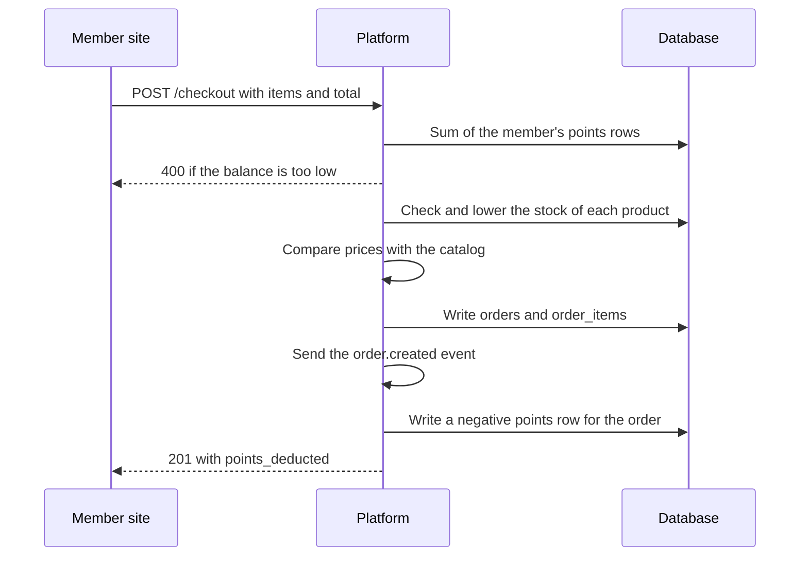

# Store

A merch store that members pay for with points. Officers add products and manage orders. Members buy with their points balance. The `storefront` switch turns the module on and off.

## In the dashboard

The Store page (Storage > Store) has two tabs:

- **Products**: name, price in points, stock, category and image. Add, edit and delete products.
- **Orders**: each order with the member, the items and the total. Change the status: pending, processing, shipped, delivered or cancelled.

## How a purchase works

1. A member opens the store and picks products.
2. Platform reads the prices from the catalog. It does not use prices that the client sends.
3. Platform checks that the member has enough points and that each product has stock.
4. Platform writes the order and lowers the stock.

The member site checkout, `POST /checkout`, does these steps.

## Routes

All routes are under `/api/storefront/<org>`.

| Route | Who | Does |
| --- | --- | --- |
| `GET /products`, `GET /products/<id>`, `GET /store` | Everyone | The catalog |
| `POST /products`, `PUT /products/<id>`, `DELETE /products/<id>` | Officers | Changes the catalog |
| `GET /orders`, `GET /orders/<id>` | Officers | Orders of the org |
| `PUT /orders/<id>`, `DELETE /orders/<id>` | Officers | Changes the status; deletes an order |
| `GET /members/store`, `GET /members/points` | Members (Discord) | The store and the member's balance |
| `GET /members/orders`, `POST /members/orders` | Members (Discord) | The member's orders; places an order |
| `POST /checkout`, `GET /wallet/<email>`, `GET /orders/<email>` | Member site token | The same for the member site |

## Limits

- Deleting an order does not give the points back.
- A new product needs stock of 1 or more.
- Checkout reads the balance and writes the order with no row lock. Two orders at the same time can spend the same points.

## Tables

`products`, `orders`, `order_items`.
