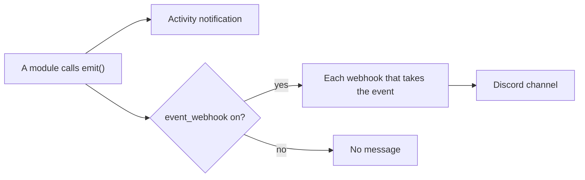

# Webhooks

The Event webhooks module (`modules/event_webhook/`) sends a message to a channel when an event happens in an org. Officers turn it on in Explore, under Webhooks, and add webhooks on its page. Each webhook has a name, a destination and the events it sends. With the module off, no event goes to a webhook, and the routes and tools return 404.

Each event also shows on the Activity page, with or without the module. The hourly limit applies only to webhook messages.



The Webhooks category has three modules. Event webhooks sends events. Job alerts webhook and Hackathon webhook post feed listings to their own webhooks (see [Feeds and the webhook modules](./modules/feeds.md)).

## Events

| Key | Label | Sent by | Sent when |
| --- | --- | --- | --- |
| `errors` | Errors | `modules/dashboard/errors.py` | A new error group, or a resolved group that comes back. See [Health, logs and errors](./operations.md#health-logs-and-errors) |
| `job.failed` | Failed job runs | `core/jobs.py` | A job with an `org_id` or `org_prefix` argument fails. Jobs for the whole server do not send it |
| `pod.started` | Pods started | `modules/godfather/service.py`, `schedule.py` | An officer or a tool starts or restarts a pod, or the session schedule starts it |
| `pod.stopped` | Pods stopped | `modules/godfather/service.py`, `schedule.py` | An officer or a tool stops or terminates a pod, or the session schedule stops it |
| `app.deployed` | App deploys | `modules/runpod/service.py` | A deploy becomes healthy, or fails |
| `order.created` | Store orders | `modules/storefront/service.py` | A member places an order |
| `member.joined` | New members | `modules/users/service.py` | A person joins the org at sign-in, through a form or a CSV import. A Discord member sync does not send it |
| `knowledge.crawl_failed` | Knowledge crawl failures | `modules/knowledge/runs.py` | A crawl of a knowledge source fails |
| `monitor.down` | Monitors down | `modules/uptime/service.py` | A monitor's first check is down, or a check is down after an up check. See [Uptime](./modules/uptime.md) |
| `monitor.up` | Monitors up | `modules/uptime/service.py` | A check is up after a down check |
| `asu.session_expired` | ASU sign-in expired | `submodules/asu/signin/service.py` | An `asu.*` tool finds that the saved ASU sign-in expired. Sent one time for each sign-in |

The page lists an event only when its module is on for the org. Pods need `godfather`, orders need `storefront` and monitors need `uptime`. Uptime checks each Hosting app; `app.deployed` says only how a deploy ended.

## Delivery

- `emit()` returns at once. A thread finds the enabled webhooks of the org that take the event and posts the message to each. A request never waits for a post.
- Each process sends at most 30 messages in an hour for each org and event. More messages in that hour are dropped.
- Each webhook keeps the time and the error of its last message. The page shows the error in red.
- "Send test" posts one message now and shows the result.
- A post has a timeout of 10 seconds and does not follow redirects. An error says the status code. It never has the URL.

## Destinations

Discord is the only kind now. A URL must match `https://discord.com/api/webhooks/<id>/<token>` and its host must resolve to public addresses (`core/net.py`). Platform encrypts the URL with `SECRETS_KEY` and never returns it. The page shows the host and the last 4 digits of the webhook id.

To add a kind, such as Slack, add a `Kind` to `KINDS` in `core/webhooks.py`: a URL pattern, an example, a function that turns a `Message` into the body, and a hint. The page reads the kinds from the API.

## Add an event

1. Declare it at the top of the module's `service.py` (or the file that sends it):

   ```python
   from core import webhooks

   webhooks.declare("thing.done", "Things done", "A thing ends.", "things")
   ```

   The last argument is the optional module that must be on for the org.
2. Send it where the event happens, after the commit:

   ```python
   webhooks.emit(org_id, "thing.done", webhooks.Message(title=f"Thing {name} done", color=webhooks.GREEN))
   ```

   `emit()` takes an org id or an org prefix. It never raises.
3. Add the event to the table on this page and to `webhookEvents` in `dashboard/scripts/fixtures.mjs`.
4. Add a test in `tests/contract/test_webhooks.py`. The `sent` fixture sends in the test thread and keeps each post.

## Routes

All routes are under `/api/dashboard/<org>/webhooks`, for officers of the org, behind the `event_webhook` switch.

| Route | Does |
| --- | --- |
| `GET /` | The webhooks, the events and kinds to pick from, the feeds of the webhook modules that are on, and `secrets_key` |
| `POST /` | Adds a webhook: `{"name", "kind": "discord", "url", "events": [...]}`. Returns 201 |
| `PUT /<id>` | Changes `name`, `url`, `events` or `enabled`. A missing key keeps its value |
| `DELETE /<id>` | Removes the webhook |
| `POST /<id>/test` | Posts a test message. Returns `{"ok", "message"}` |

## Feeds and the server webhook

- The feeds of the Job alerts webhook and Hackathon webhook modules post listings to their own webhooks. Set them on the page of each module. See [Feeds and the webhook modules](./modules/feeds.md).
- `ERROR_WEBHOOK_URL` in `.env` gets every new error of every org and of the server. It is not an org webhook and does not show on the page.

The `webhooks` table is in [Data model](./data-model.md). Migration `a1358e0da9ef` moved each org secret `error_webhook_url` to a webhook named Errors that sends `errors`.
